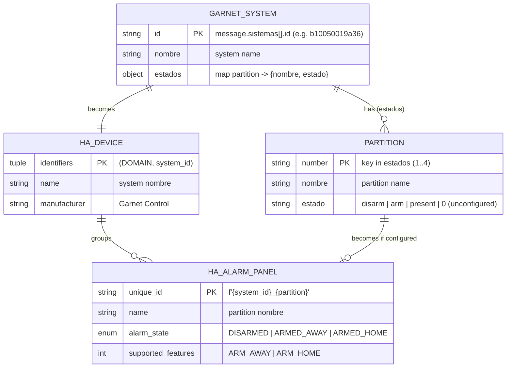
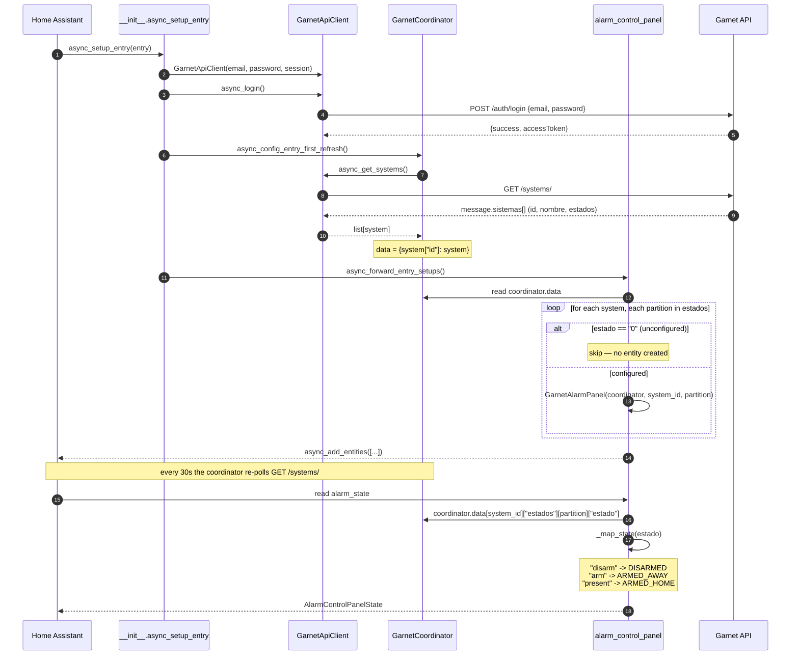

# Architecture

Diagrams documenting the software structure. Keep them in sync with the code
whenever the data model or the API→entity mapping changes. See
[`api-notes.md`](./api-notes.md) for the raw API payloads.

## Entity-relationship diagram (DER)

How the Garnet API objects map to Home Assistant devices and entities.

Notes:

- A partition with `estado == "0"` is **unconfigured** and does **not** become an
  entity (see `PARTITION_STATE_UNCONFIGURED`).
- The `estado` maps to `DISARMED` (`"disarm"`), `ARMED_AWAY` (`"arm"`) or
  `ARMED_HOME` (`"present"` — armed with some zones bypassed).

## Sequence: populating and mapping an entity

From config-entry setup to a live `alarm_control_panel` entity, showing how the
API response is mapped into HA.

